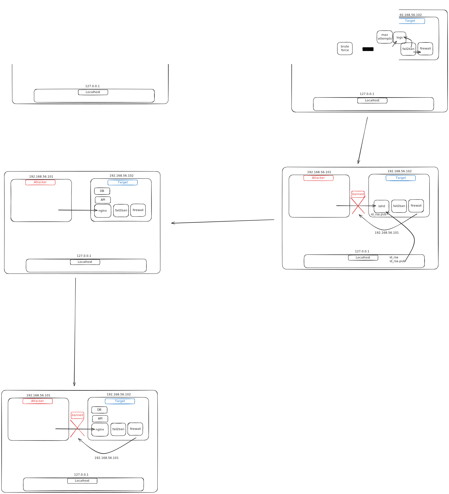

# Demo — Secure VM and web app, and attack them

> Objective — Run a reproducible, isolated lab: bring up two VMs with Vagrant, harden the target VM and a simple web app, run attacker scenarios from the other VM, observe defender controls and metrics.

---

## Intro

**What this demo covers**

* Provision a small lab (2 VMs) with Vagrant.
* Harden the target VM and a simple web app.
* Run attacker scenarios (recon, brute, load/slow attacks) from an attacker VM.
* Tune defenses (Fail2Ban, firewall, Nginx limits) and measure impact.

**Why / relation to other tutorials**

* This demo ties together the three tutorial topics: lab provisioning, VM hardening and web-app hardening + testing. See the full guides used during the demo:
* Vagrant / lab setup: [https://github.com/Sight-ech/how_to/blob/main/set_up_vagrant_ubuntu.md](https://github.com/Sight-ech/how_to/blob/main/set_up_vagrant_ubuntu.md)
* VPS hardening (Rocky): [https://github.com/Sight-ech/how_to/blob/main/secure_vps_rocky.md](https://github.com/Sight-ech/how_to/blob/main/secure_vps_rocky.md)
* Web app hardening & security layers: [https://github.com/Sight-ech/how_to/blob/main/secure_web_app.md](https://github.com/Sight-ech/how_to/blob/main/secure_web_app.md)


**Security layers (quick pointer)**

* We follow the layered model in the secure_web_app guide: (edge / network) → (host / OS) → (reverse proxy / web server) → (app / auth / rate limits) → (monitoring & response).
  For more detail and the diagram, open the web-app security doc above.

---

**Quick difference: libvirt/KVM vs VirtualBox**

* **libvirt / KVM**

  * Hypervisor based on QEMU/KVM; kernel-level virtualization (better raw performance).
  * Runs headless easily (good for CI and servers).
  * Better integration with system-level tooling (virsh, virt-manager).
  * Requires `vagrant-libvirt` plugin to use with Vagrant.
* **VirtualBox**

  * User-space hypervisor with GUI support; simple desktop setup and snapshots.
  * Easier for cross-platform desktop demos (Windows/Mac).
  * Slightly lower I/O/CPU performance vs KVM for heavy workloads.
* **Which to choose for this demo:** prefer **libvirt/KVM** for headless, reproducible, closer-to-production behaviour; use VirtualBox if demoing on a laptop with a GUI or where libvirt isn't available.

---

**Assumptions / prerequisites**

* You already have the repo / project files, Vagrantfile and provisioning scripts in place.
* On your host machine you have at least one of:

  * libvirt + qemu + vagrant + `vagrant-libvirt` plugin OR
  * VirtualBox + Vagrant
* Basic host commands available: `git`, `vagrant`, `virsh` (if using libvirt), `ssh`, `curl`.
* The test uses:

  * VM1 = **attacker/operator** (run loadtests, nmap, locust, ab, curl)
  * VM2 = **target** (Rocky Linux, web app, Nginx, Fail2Ban, firewall)

---
## Table of Contents

- [Demo — Secure VM and web app, and attack them](#demo--secure-vm-and-web-app-and-attack-them)
  - [Intro](#intro)
  - [Table of Contents](#table-of-contents)
- [Steps](#steps)
  - [Init](#init)
  - [Set up Vagrant VMs](#set-up-vagrant-vms)
  - [SSH Attack and Protection](#ssh-attack-and-protection)
    - [First brute force attack](#first-brute-force-attack)
    - [First protection steps](#first-protection-steps)
    - [Second protection steps](#second-protection-steps)
    - [Third protection steps](#third-protection-steps)
  - [Web App Attack and Protection](#web-app-attack-and-protection)
    - [Set up the web app](#set-up-the-web-app)
    - [Architecture of the API](#architecture-of-the-api)
    - [Play with our web app](#play-with-our-web-app)
    - [Brute force attack on web app login](#brute-force-attack-on-web-app-login)
    - [Locust Scenarios](#locust-scenarios)
    - [first protection steps](#first-protection-steps-1)
      - [Create Filters](#create-filters)
      - [Create Jails](#create-jails)
      - [IP tables verification](#ip-tables-verification)
    - [Check the protections](#check-the-protections)
  - [End Note](#end-note)


---

# Steps

Here is the roadmap of the steps we will follow in this demo:



---

## Init
```bash
git clone https://github.com/Sight-ech/demos.git
cd demos/1_how_to_protect_a_vm_and_webapp/
```

**Share useful links**
Vagrant / lab setup: https://github.com/Sight-ech/how_to/blob/main/set_up_vagrant_ubuntu.md
Secure VPS Rocky Linux: https://github.com/Sight-ech/how_to/blob/main/secure_vps_rocky_linux.md
Secure Web App: https://github.com/Sight-ech/how_to/blob/main/secure_web_app.md


## Set up Vagrant VMs
```bash
# Check hardware virtualization support
egrep -c '(vmx|svm)' /proc/cpuinfo   # Prerequisite: hardware virtualization support
# should return a number > 0

# Check libvirt installation
sudo systemctl status libvirtd
sudo systemctl enable --now libvirtd

# Check Vagrant and libvirt plugin installation
vagrant --version
virsh --version   # if using libvirt

# Check Vagrant libvirt plugin
vagrant plugin list | grep vagrant-libvirt

# Set up and start Vagrant VMs
cd ./vagrant/
vagrant up attacker --provider=libvirt
vagrant up target --no-provision --provider=libvirt
vagrant provision target --provision-with install_docker

# Check VMs status
vagrant global-status
virsh --connect qemu:///system list --all
```

## SSH Attack and Protection

### First brute force attack
```bash
export VM2_IP=$(vagrant ssh target -c "hostname -I | awk '{print \$2}'" | tr -d '\r')

vagrant ssh attacker -c "nmap -Pn -p 22,80,443 $VM2_IP"


# Go into the attacker VM
vagrant ssh attacker

cd /vagrant/attacker/
pip install -r requirements.txt

export VM2_IP=192.168.56.102
python multi_ssh_brutforce.py --host $VM2_IP \
--username vagrant \
--password-file 200_passwords.txt

# Found password is "vagrant"
ssh vagrant@$VM2_IP
```

### First protection steps

Here we will change the SSH port and limit the number of authentication attempts.

```bash
# From target VM
sudo vi /etc/ssh/sshd_config
# Change the port from 22 to 50022
# Set MaxAuthTries 3 (Not very useful, but good to have)

# Restart SSH
sudo systemctl restart sshd
```

```bash
# From attacker VM
conda activate demos # for localhost test
python async_ssh_brutforce.py --host 192.168.56.102 --port 50022 --username vagrant --password-file 200_passwords.txt
```
You'll see that the brute force attack fails now and cannot find the password.
For sure, if we would improve the brute force script to retry after some time, it could eventually find the password.

Now test connection from localhost to the target with the password, you'll see that too many attempts will block you for some time.

```bash
# From localhost
ssh -p 50022 vagrant@192.168.56.102
```
(Remove MaxAuthTries to avoid being blocked when testing manually.)

### Second protection steps

Here we will set up fail2ban to block IPs that try to brute force SSH.

```bash
# From target VM

# Install fail2ban
sudo dnf install epel-release -y
sudo dnf install fail2ban -y

# Set up fail2ban for SSH
sudo systemctl enable fail2ban
sudo systemctl start fail2ban

sudo cp /etc/fail2ban/jail.conf /etc/fail2ban/jail.local
sudo vi /etc/fail2ban/jail.local
# Under [sshd], set:
# enabled = true
# port = 50022

# Restart fail2ban
sudo systemctl restart fail2ban
sudo systemctl status fail2ban
```

> (Attention: Change the ssh port in the Vagrantfile to 50022 to keep Vagrant SSH working after changing the SSH port on the target VM.)
> config.ssh.port = 50022


```bash
# From attacker VM
conda activate demos # for localhost test
python multi_ssh_brutforce.py --host 192.168.56.102 --port 50022 --username vagrant --password-file 200_passwords.txt
```

Now try several times to brute force SSH again. After 3 failed attempts, your IP should be banned and further attempts will be blocked.

Find another way to access the VM, and check the fail2ban-client status:

```bash
sudo fail2ban-client status
sudo fail2ban-client status sshd
```

As you can see, the SSH protection is now effective.
```
Status
|- Number of jail:      1
`- Jail list:   sshd
#
Status for the jail: sshd
|- Filter
|  |- Currently failed: 1
|  |- Total failed:     19
|  `- Journal matches:  _SYSTEMD_UNIT=sshd.service + _COMM=sshd + _COMM=sshd-session
`- Actions
   |- Currently banned: 2
   |- Total banned:     2
   `- Banned IP list:   192.168.56.101 192.168.56.1
```

You can unban your IP with:

```bash
sudo fail2ban-client set sshd unbanip 192.168.56.1
# Or second attacker IP
sudo fail2ban-client set sshd unbanip 192.168.56.101
```

### Third protection steps

The best way to protect SSH is to use key-based authentication and disable password authentication. It will completely block brute force attacks.

For that, we will generate an SSH key pair on our host machine, copy the public key to the VM, and disable password authentication in SSH.

```bash
# Generate SSH key pair
ssh-keygen -t ed25519 -C "your_email@example.com" -f ./keys/id_rsa
ssh-copy-id -p 50022 -i ./keys/id_rsa.pub vagrant@192.168.56.102

ssh -i ./keys/id_rsa -p 50022 vagrant@192.168.56.102

# Disable password authentication
sudo vi /etc/ssh/sshd_config
# Set PasswordAuthentication no

# Restart SSH
sudo systemctl restart sshd
```

Test again the brute force attack:
```bash
# From attacker VM
conda activate demos # for localhost test
python async_ssh_brutforce.py --host 192.168.56.102 --port 50022 --username vagrant --password-file 200_passwords.txt
```

It will fail to connect since password authentication is disabled.

## Web App Attack and Protection

### Set up the web app

```bash
vagrant provision target --provision-with install_docker
vagrant rsync target
vagrant provision target --provision-with deploy_webapp
```

**Access the web app**
Open your web browser and go to http://192.168.56.102:8080

In our web app, we have **3 main components**:
1. The API (the web application itself)
2. The reverse proxy (Nginx)
3. The database (SQLite)

Here is the architecture diagram of our web app:

```
┌──────────────┐  http  ┌─────────────┐        ┌──────────────┐
│   Internet   │──────▶ │  Reverse    │──────▶ │    API       │
│   Clients    │        │   Proxy     │        │ (Web App)    │
└──────────────┘        └─────────────┘        └──────────────┘
                                                      |
                                                      ▼
                                               ┌──────────────┐
                                               │   Database   │
                                               │   (SQLite)   │
                                               └──────────────┘
```

### Architecture of the API
An API is a simple web application that exposes endpoints to perform operations.
It makes the interface between users and the logic of the application.

In our case, I built a simple API that allows users to login, add values, and get the sum of the added values. So if I had to represent it, it would look like this:

```
┌─────────┐      ┌─────────────┐      ┌──────────────┐
│  User   │─────▶│  API (HTTP) │─────▶│  App Logic   │
└─────────┘      └─────────────┘      └──────────────┘
            │
            ├─ GET /         → render index page
            ├─ GET /health   → check health
            ├─ POST /login   → authenticate login
            ├─ POST /logout  → authenticate logout
            ├─ GET  /add     → get sum
            ├─ POST /add     → add value
            ├─ GET /io       → simulate I/O bound
            └─ GET /compute  → simulate compute
```

---

### Play with our web app
Let's play with our web app using curl commands.
So curl commands are usally used to interact with web applications from the command line.
They do the same the same job as a web browser but from the terminal.

```bash
# Check the health
curl http://192.168.56.102:8080/health

# Get current values (Non authenticated) --> Unauthorized
curl http://192.168.56.102:8080/add

# Login
curl -s -X POST http://192.168.56.102:8080/login   -H "Content-Type: application/json"   -d '{"username":"demo","password":"changeme"}'

# Login and save cookies
curl -s -X POST http://192.168.56.102:8080/login   -H "Content-Type: application/json"   -d '{"username":"demo","password":"changeme"}'   -c cookies.txt

# Get current values (Authenticated) --> Return sum
curl -s http://192.168.56.102:8080/add -b cookies.txt

# Add value (Authenticated)
curl -s -X POST http://192.168.56.102:8080/add -H "Content-Type: application/json"   -d '{"value":5}' -b cookies.txt

# Get current values (Authenticated) --> Return sum: 5
curl -s http://192.168.56.102:8080/add -b cookies.txt
```

Usually, credentials are not stored in cookies but in tokens (JWT, OAuth2, etc). But for the sake of simplicity, we use cookies here. Technically, the cookie contains a session ID that is mapped to the user session on the server side.

### Brute force attack on web app login

```bash
# From attacker VM
cd /vagrant/attacker/
python async_http_brutforce.py --host 192.168.56.102 --port 8080 --endpoint /login --username demo --password-file 200_passwords.txt
```

### Locust Scenarios

Locust is an open-source load testing tool that allows you to define user behavior with Python code and simulate millions of users to test the performance of your web applications.
Here we will run 3 different scenarios to test our web app. In the meantime, we will monitor the CPU and memory usage on the target VM and the response time of the health endpoint.

By the way, we have defined limits on our docker containers in the docker-compose.yml file to simulate resource constraints:
```yaml
    deploy:
      resources:
        limits:
          cpus: "0.25" # max 25% of a CPU
          memory: 512M # hard memory limit
        reservations:
          cpus: "0.25" # optional
          memory: 256M
```

```bash
# From target VM
sudo docker stats

# From Terminal 3
curl http://192.168.56.102:8080/health

watch -n 2 'status=$(curl -s -o /dev/null -w "%{http_code}" http://192.168.56.102:8080/health); \
if [ "$status" = "200" ]; then \
  echo "Status: $status (UP)"; \
  curl -s -w "Response time: %{time_total}s\n" http://192.168.56.102:8080/health; \
else \
  echo "Status: $status (DOWN)"; \
fi'
```

**Scenario 1: normal users**
```bash
# From attacker VM
cd /vagrant/attacker/load/
locust -f locustfile.py -H http://192.168.56.102:8080
# Open browser at http://192.168.56.101:8089
```

**Scenario 2: ddos without users**
```bash
# From attacker VM
cd /vagrant/attacker/load/
locust -f locust_ddos_not_real.py -H http://192.168.56.102:8080 -u 5000 -r 200
# Open browser at http://192.168.56.101:8089
```

**Scenario 3: ddos with normal users**
```bash
# From attacker VM
cd /vagrant/attacker/load/
locust -f locust_ddos_real.py -H http://192.168.56.102:8080 -u 5000 -r 200
# Open browser at http://192.168.56.101:8089
```

Here we can clearly see that the health endpoint becomes unresponsive under heavy load.
It was around 20ms response time before the attack and now it is going to 14000ms and even more.

Now let's set up protections to mitigate these attacks.

### first protection steps

Configure your nginx default.conf to define a specific log file for the API access log.

Define the log format in `nginx/default.conf`:
```bash
log_format vpsguard '$remote_addr - $remote_user [$time_local] '
                    '"$request" $status $body_bytes_sent '
                    '"$http_user_agent" "$http_referer"';

access_log /var/log/nginx/access.log vpsguard;
error_log  /var/log/nginx/error.log;
```

And map it in the docker-compose.yml file.
```yaml
    volumes:
      - ./nginx/default.conf:/etc/nginx/conf.d/default.conf:ro
```
It lets us have a dedicated access log with specific format that we can use to create a fail2ban filter.

#### Create Filters

After setting up the access log, we can create a fail2ban filter to detect failed authentication attempts on the API.

We’ll create 2 filters:
- nginx-login-abuse → detects repeated login failures
- nginx-health-flood → detects excessive /health requests

**Filter 1: nginx-login-abuse**
It protects against brute-force attacks on the /login endpoint by banning IPs with multiple failed login attempts (HTTP 401).

```bash
# From target VM
sudo vi /etc/fail2ban/filter.d/nginx-login-abuse.conf

# Add:
[Definition]
failregex = ^<HOST> - .*POST /login HTTP/1\.[01]" 401
ignoreregex =
```
**Filter 2: nginx-health-flood**
It protects against denial-of-service attacks by banning IPs that flood the /health endpoint with excessive requests (HTTP 200).
```bash
# From target VM
sudo vi /etc/fail2ban/filter.d/nginx-health-flood.conf

# Add:
[Definition]
failregex = ^<HOST> - .*GET /health HTTP/1\.[01]" 200
ignoreregex =
```

---

> Here is **another example** of a fail2ban filter to block HTTP 401 and 403 errors in Nginx access logs:
> ```
> [Definition]
>failregex = ^<HOST> -.*"(GET|POST|PUT|DELETE|PATCH).*HTTP.*" (401|403)
>ignoreregex =
>```

---

#### Create Jails
Now that we have created the filters, we can create the corresponding jails in fail2ban to activate the protections.

**Jail 1: nginx-login-abuse**

```bash
# From target VM
sudo vi /etc/fail2ban/jail.d/nginx-login-abuse.conf

# Add:
[nginx-login-abuse]
enabled  = true
filter   = nginx-login-abuse
logpath  = /var/log/nginx/access.log
port     = 80
protocol = tcp
# allow 6 failed logins
maxretry  = 6
# within 60 seconds
findtime  = 60
# ban for 5 minutes
bantime   = 300

action = iptables-multiport[name=nginx-login-abuse, port="80", protocol=tcp, chain=DOCKER-USER]
```

**Jail 2: nginx-health-flood**

```bash
# From target VM
sudo vi /etc/fail2ban/jail.d/nginx-health-flood.conf

# Add:
[nginx-health-flood]
enabled  = true
filter   = nginx-health-flood
logpath  = /var/log/nginx/access.log
port     = 80
protocol = tcp
# allow 50 requests
maxretry  = 10
# within 10 seconds
findtime  = 1
# ban for 5 minutes
bantime   = 300

action = iptables-multiport[name=nginx-health-flood, port="80", protocol=tcp, chain=DOCKER-USER]
```

Restart fail2ban to apply the changes:
```bash
sudo systemctl restart fail2ban
sudo systemctl status fail2ban
```

Check the status of the new jails:
```bash
sudo fail2ban-client status nginx-login-abuse
sudo fail2ban-client status nginx-health-flood
```
You should see the jails are active and ready to protect your web app against brute-force login attempts and health endpoint flooding.

#### IP tables verification

Check the iptables rules, it should show no banned IPs at the beginning and empty chains for our jails:
```bash
sudo iptables -L DOCKER-USER -n --line-numbers -v

# Check specific chains for our jails --> should be empty at the beginning
sudo iptables -L f2b-nginx-login-abuse -n -v --line-numbers
sudo iptables -L f2b-nginx-health-flood -n -v --line-numbers
```

---

### Check the protections
Now that we have set up the protections, we can test them by running the brute-force attack on the /login endpoint and the locust DDoS scenario on the /health endpoint again.


**Case 1: Brute-force attack on /login**
Here is the brute-force attack and it will activate the nginx-login-abuse jail and ban the attacker IP after 6 failed attempts.

```bash
# From attacker VM
cd /vagrant/attacker/
python async_http_brutforce.py --host 192.168.56.102 --port 8080 --endpoint /login --username demo --password-file 200_passwords.txt

# Should return: Connection refused
curl http://192.168.56.102:8080/health

# From target VM
sudo fail2ban-client status nginx-login-abuse
sudo sudo iptables -L f2b-nginx-login-abuse -n -v --line-numbers

# Unban attacker IP
sudo fail2ban-client set nginx-login-abuse unbanip 192.168.56.101
```

>⚠️ Here we blocked the attacker to access the /login endpoint after 6 failed attempts and avoid potential account compromise.


**Case 2: DDoS attack on /health**
Here is the locust DDoS scenario and it will activate the nginx-health-flood jail and ban the attacker IP after 50 requests within 10 seconds.

```bash
# From attacker VM
cd /vagrant/attacker/load/
locust -f locust_ddos_not_real.py -H http://192.168.56.102:8080 -u 5000 -r 200
# Should return: Connection refused

# From target VM
sudo fail2ban-client status nginx-health-flood
sudo sudo iptables -L f2b-nginx-health-flood -n -v --line-numbers

# Unban attacker IP
sudo fail2ban-client set nginx-health-flood unbanip 192.168.56.101
```

>⚠️ Here we protected the /health endpoint from being overwhelmed by excessive requests and ensured its availability for legitimate users.

---

## End Note
**Congratulations!**
You have successfully protected a VM and a web application against various attacks using multiple layers of security.

Now go to **Kahoot** !!
